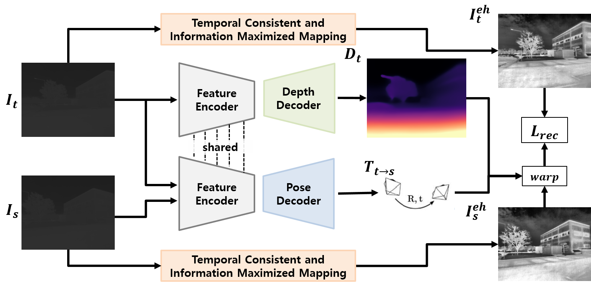
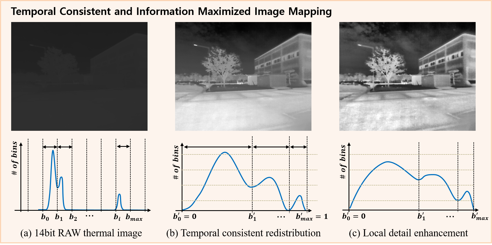
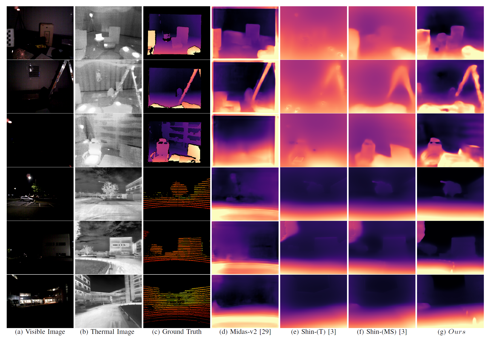
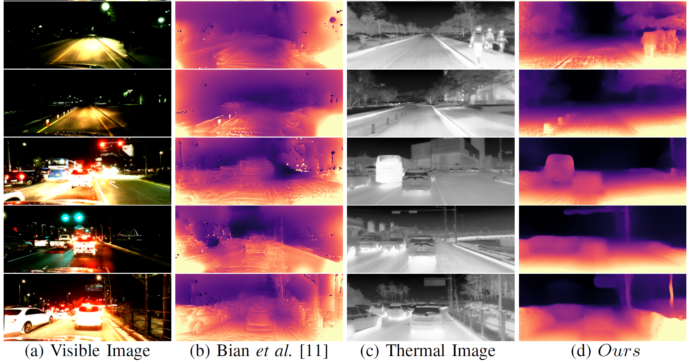

# Maximizing Self-supervision from Thermal Image for Effective Self-supervised Learning of Depth and Ego-motion

This github is a official implementation of the paper:

 >Maximizing Self-supervision from Thermal Image for Effective Self-supervised Learning of Depth and Ego-motion
 >
 >[Ukcheol Shin](https://ukcheolshin.github.io/), [Kyunghyun Lee](https://scholar.google.co.kr/citations?user=WOBfTQoAAAAJ&hl=ko&oi=ao), [Byeong-Uk Lee](https://sites.google.com/view/bulee), In So Kweon
 >
 >**Robotics and Automation Letter 2022 & IROS 2022**
 >
 >[[PDF](https://arxiv.org/abs/2201.04387)] [[Project webpage](https://sites.google.com/view/thermal-monodepth-project-page)] [[Full paper](https://arxiv.org/abs/2201.04387)] [[Youtube](https://youtu.be/qIBcOuLYr70)] 

## Introduction
Recently, self-supervised learning of depth and ego-motion from thermal images shows strong robustness and reliability under challenging lighting and weather conditions.
However, the inherent thermal image properties such as weak contrast, blurry edges, and noise hinder to generate effective self-supervision from thermal images.
Therefore, most previous researches just rely on additional self-supervisory sources such as RGB video, generative models, and Lidar information.
In this paper, we conduct an in-depth analysis of thermal image characteristics that degenerates self-supervision from thermal images. 
Based on the analysis, we propose an effective thermal image mapping method that significantly increases image information, such as overall structure, contrast, and details, while preserving temporal consistency.
By resolving the fundamental problem of the thermal image, our depth and pose network trained only with thermal images achieves state-of-the-art results without utilizing any extra self-supervisory source.
As our best knowledge, this work is the first self-supervised learning approach to train monocular depth and relative pose networks with only thermal images.

<p align="center">
  
  
</p>

<p align="center">
  
</p>
<p align="center">
  
</p>

Please refer to the video for more descriptions and visual results.

[](https://youtu.be/oNu_YVf8sCc)

## Main Results

### Depth Results

#### Indoor test set (Well-lit)

|   Models   | Abs Rel | Sq Rel | RMSE  | RMSE(log) | Acc.1 | Acc.2 | Acc.3 |
|------------|---------|--------|-------|-----------|-------|-------|-------|
| Shin(T)    | 0.225   | 0.201  | 0.709 | 0.262     | 0.620 | 0.920 | 0.993 |
| Shin(MS)   | 0.156   | 0.111  | 0.527 | 0.197     | 0.783 | 0.975 | 0.997 |
| Ours       | 0.152   | 0.121  | 0.538 | 0.196     | 0.814 | 0.965 | 0.992 |

#### Indoor test set (Low-/Zero- light)

|   Models   | Abs Rel | Sq Rel | RMSE  | RMSE(log) | Acc.1 | Acc.2 | Acc.3 |
|------------|---------|--------|-------|-----------|-------|-------|-------|
| Shin(T)    | 0.232   | 0.222  | 0.740 | 0.268     | 0.618 | 0.907 | 0.987 |
| Shin(MS)   | 0.166   | 0.129  | 0.566 | 0.207     | 0.768 | 0.967 | 0.994 |
| Ours       | 0.149   | 0.109  | 0.517 | 0.192     | 0.813 | 0.969 | 0.994 |

#### Outdoor test set (Night-time)

|   Models   | Abs Rel | Sq Rel | RMSE  | RMSE(log) | Acc.1 | Acc.2 | Acc.3 |
|------------|---------|--------|-------|-----------|-------|-------|-------|
| Shin(T)    | 0.157   | 1.179  | 5.802 | 0.211     | 0.750 | 0.948 | 0.985 |
| Shin(MS)   | 0.146   | 0.873  | 4.697 | 0.184     | 0.801 | 0.973 | 0.993 |
| Ours       | 0.109   | 0.703  | 4.132 | 0.150     | 0.887 | 0.980 | 0.994 |


### Pose Estimation Results 

#### Indoor-static-dark

|Metric               | ATE     | RE      |
|---------------------|---------|---------|
| Shin(T)             | 0.0063  | 0.0092  |
| Shin(MS)            | 0.0057  | 0.0089  | 
| Ours                | 0.0059  | 0.0082  | 

#### Outdoor-night1

|Metric               | ATE     | RE      |
|---------------------|---------|---------|
| Shin(T)             | 0.0571  | 0.0280  |
| Shin(MS)            | 0.0562  | 0.0287  | 
| Ours                | 0.0546  | 0.0287  | 

## Getting Started

### Prerequisite
This codebase was developed and tested with python 3.7, Pytorch 1.5.1, and CUDA 10.2 on Ubuntu 16.04. 

```bash
conda env create --file environment.yml
```

### Pre-trained Model
Our pre-trained models are availabe in this [link](https://drive.google.com/drive/folders/1ne2yyGMifciHG3uXj6xjc4q_KtX8z4Ki?usp=sharing)

### Datasets

For ViViD Raw dataset, download the dataset provided on the [official website](https://sites.google.com/view/dgbicra2019-vivid/).

For our post-processed dataset, please refer to [this Github page](https://github.com/UkcheolShin/ThermalSfMLearner-MS).

After download our post-processed dataset, unzip the files to form the below structure.

#### Expected dataset structure for the post-processed ViViD dataset:
```
KAIST_VIVID/
  calibration/
    cali_ther_to_rgb.yaml, ...
  indoor_aggressive_local/
    RGB/
      data/
        000001.png, 000002.png, ...
      timestamps.txt
    Thermal/
      data/
      timestamps.txt
    Lidar/
      data/
      timestamps.txt
    Warped_Depth/
      data/
      timestamps.txt
    avg_velocity_thermal.txt
    poses_thermal.txt
    ...
  indoor_aggressive_global/
    ...	
  outdoor_robust_day1/
    ...
  outdoor_robust_night1/
    ...
```

Upon the above dataset structure, you can generate training/testing dataset by running the script.
```bash
sh scripts/prepare_vivid_data.sh
```

### Training

The "scripts" folder provides several examples for training, testing, and visualization.

You can train the depth and pose model on vivid dataset by running
```bash
sh scripts/train_vivid_resnet18_indoor.sh
sh scripts/train_vivid_resnet18_outdoor.sh
```
Then you can start a `tensorboard` session in this folder by
```bash
tensorboard --logdir=checkpoints/
```
and visualize the training progress by opening [https://localhost:6006](https://localhost:6006) on your browser. 


### Evaluation

You can evaluate depth and pose by running
```bash
bash scripts/test_vivid_indoor.sh
bash scripts/test_vivid_outdoor.sh
```
and visualize depth by running
```bash
bash scripts/run_vivid_inference.sh
```
You can comprehensively see the overall results by running
```bash
bash scripts/display_result.sh
```

## Citation
Please cite the following paper if you use our work, parts of this code, and pre-processed dataset in your research.
 
	@ARTICLE{shin2022maximize,  
		author={Shin, Ukcheol and Lee, Kyunghyun and Lee, Byeong-Uk and Kweon, In So},  
		journal={IEEE Robotics and Automation Letters},   
		title={Maximizing Self-Supervision From Thermal Image for Effective Self-Supervised Learning of Depth and Ego-Motion},   
		year={2022},  
		volume={7},  
		number={3},  
		pages={7771-7778},  
		doi={10.1109/LRA.2022.3185382}
	}	

## Related projects
 
 * [SfMLearner-Pytorch](https://github.com/ClementPinard/SfmLearner-Pytorch) (CVPR 2017)
 * [SC-SfMLearner-Pytorch](https://github.com/JiawangBian/SC-SfMLearner-Release) (NeurIPS 2019)
 * [Thermal-SfMLearner-Pytorch](https://github.com/UkcheolShin/ThermalSfMLearner-MS) (RA-L 2021 & ICRA 2022)
